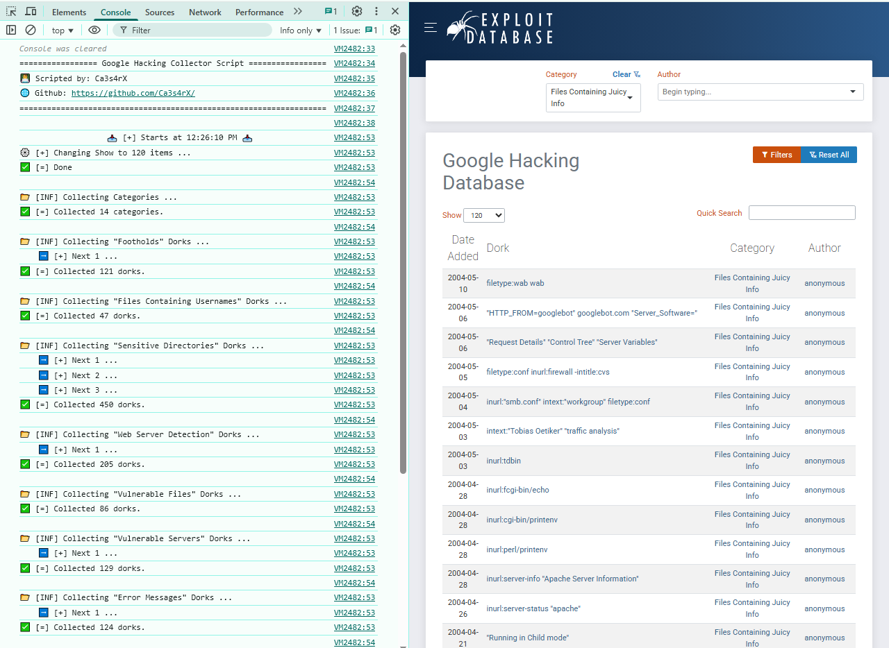

# 🔍 GHDB Dorks Scrapper

A browser-based JavaScript automation script to scrape **Google Hacking Database (GHDB)** dorks from Exploit-DB — organized by category and exported into structured JSON.  

---

## 📸 Screenshot



---

## ✨ Features

- 📋 Scrapes dorks for each category with pagination
- 📁 Exports results into a well-formatted `.json` file
- 🔧 Uses custom display banners and timestamps

---

## 🧪 How to Use

1. Go to: https://www.exploit-db.com/google-hacking-database?category=1
2. Open your browser console (`F12` or `Ctrl+Shift+I`) and switch to the **Console** tab
3. Paste the script and press **Enter**
4. Wait while:
   - Categories and dorks are collected
   - JSON file is automatically downloaded
5. Watch progress messages in the console

---

## 📁 Sample Output

```json
{
  "Footholds": [
    "inurl:adminpanel site:gov.*",
    "inurl:maps.arcgis.com +\"City of\"",
    "inurl:wsnavigator/jsps",
    "intitle:\"index of\" \"httpd.pid\"",
    "mail/u/0 filetype:pdf",
    "inurl:\"/plugins/servlet/Wallboard/\"",
    "intitle:(\"Mini Shell\") AND intext:(\"Upload File\")",
    "site:*/wp-admin/install.php intitle:WordPress Installation",
    "intitle:\"WSO 2.4\" [ Sec. Info ], [ Files ], [ Console ]",
    "inurl:\"/sidekiq/busy\""
  ]
}
```
---

## 👨‍💻 Author

**Ca3s4rX**  
🔗 GitHub: [https://github.com/Ca3s4rX](https://github.com/Ca3s4rX)

---

## ⭐️ Star the Repo

If you found this project helpful, please give it a ⭐️ to support its continued development!
